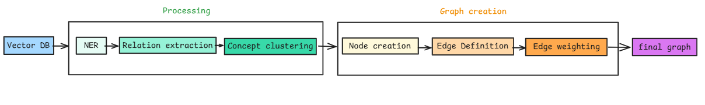

Pipeline Architecture
=====================

The TEXTRA-IA Research pipeline is composed of several interconnected components that work together to process, analyze, and synthesize scientific publications. This document details each component and their interactions.

   TEXTRA-IA Research Pipeline Architecture Diagram
Input Processing
---------------

The system accepts three types of input:

1. **Audio Input**
   - Processed through audio-to-text conversion
   - Converted text feeds into the main context processing pipeline

2. **Text Input**
   - Direct text input from scientific publications
   - Feeds directly into context processing

3. **Image Input**
   - Undergoes specialized image processing
   - Generates image descriptions using computer vision
   - Descriptions are integrated with textual context

   Input Processing

Context and Synthesis
--------------------

The core processing pipeline consists of:

1. **Context Processing**
   - Aggregates inputs from multiple sources
   - Integrates text, transcribed audio, and image descriptions
   - Produces PDF output for archival
   - Feeds into the multi-agent system

2. **Multi-Agent System**
   - Coordinates analysis across specialized agents
   - Manages task distribution and aggregation
   - Ensures coherent processing flow

3. **Synthesis**
   - Generates final outputs based on multi-agent processing
   - Creates comprehensive research summaries and analyses

Knowledge Base Creation
---------------------

The knowledge base creation process involves:

1. **Batch Processing**
   - Handles multiple PDF documents simultaneously
   - Extracts structured information
   - Stores in database format

2. **Database Structure**
   - PDF metadata storage
     * Clé (hashlib)
     * Title
     * References
     * Notes/clés
     * Date
     * Path
     * Vectorized (boolean)
   - Figure handling
     * ID
     * Image description
     * Type

3. **Vectorization**
   - Converts processed text into vector representations
   - Utilizes LVM finetuned models
   - Enables efficient similarity search and analysis

   Knowledge Base Creation

Concepts Graph Processing
------------------------

The concept graph generation consists of two main phases:

1. **Processing Phase**
   - Vector DB integration
   - NER (Named Entity Recognition)
   - Relation extraction
   - Concept clustering

2. **Graph Creation Phase**
   - Node creation from extracted concepts
   - Edge definition between related concepts
   - Edge weighting based on relationship strength
   - Final graph generation

   Concepts Graph Processing

Research Synthesis System
------------------------

The research synthesis component operates in two stages:

1. **Retrieval Stage**
   - Vector search in the knowledge base
   - Context ranking for relevance
   - Extraction of relevant excerpts
   - Topic analysis for categorization

2. **Synthesis Stage**
   - Information consolidation
   - Formatting for output
   - Final synthesis generation

   Research Synthesis System

Timeline and Trend Analysis
--------------------------

A dedicated system for temporal analysis includes:

1. **Data Sources**
   - Vector DB for concept information
   - Temporal data for chronological analysis
   - Publication metadata for contextual information

2. **Analysis Components**
   - Temporal clustering of research topics
   - Keyword evolution tracking
   - Citation pattern analysis

3. **Output Generation**
   - Growth trajectory visualization
   - Trend scoring and analysis
   - Timeline generation
   - Trend visualization
   - Emerging concepts identification

   Timeline and Trend Analysis
Integration Points
----------------

The system maintains several critical integration points:

1. **Data Flow**
   - Seamless transfer between components
   - Consistent data format maintenance
   - Error handling and recovery

2. **Vector Database**
   - Central repository for processed information
   - Enables efficient retrieval and analysis
   - Maintains relationships between concepts

3. **Output Generation**
   - Multiple output formats (PDF, visualizations, summaries)
   - Customizable based on user needs
   - Integration with existing research workflows

